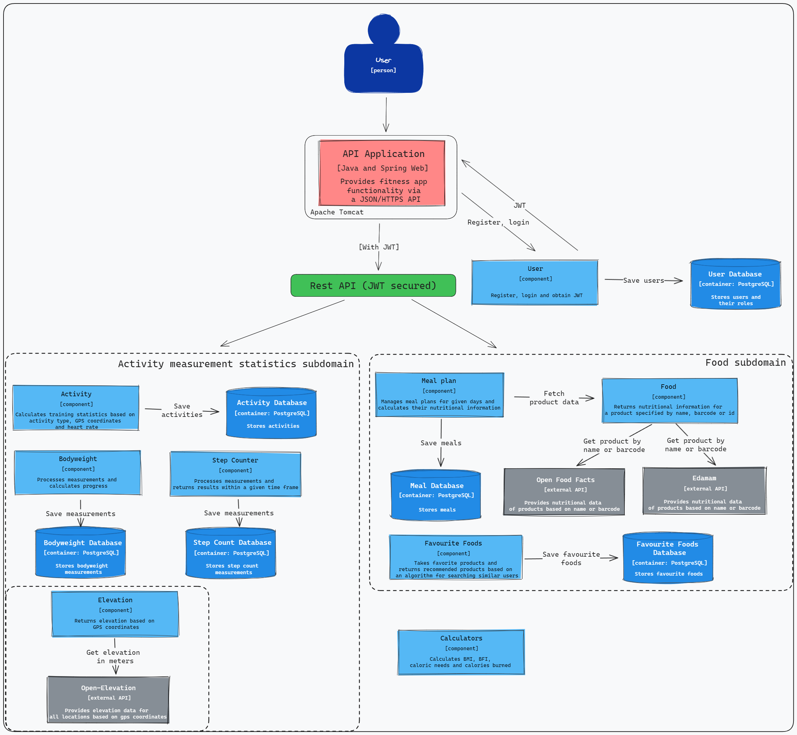
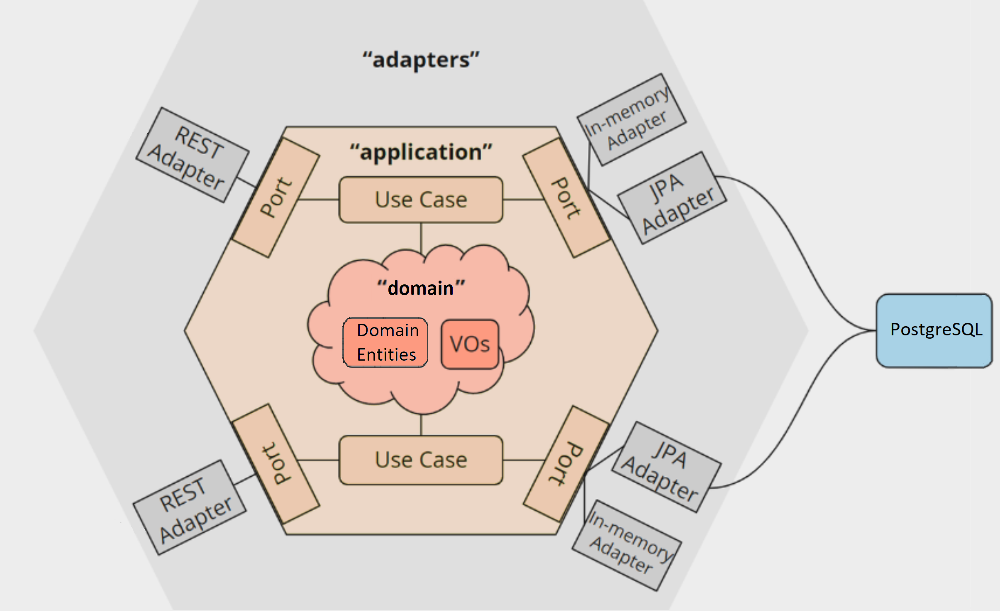
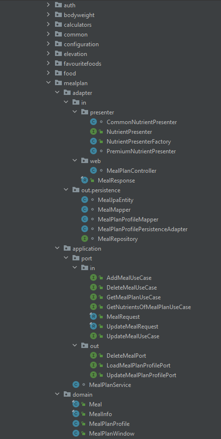

# Fitness App
Fitness App is an application created to promote a healthy lifestyle and physical activity for users. It was designed for people who want to lead an active lifestyle, take care of their fitness and health. The app offers a wide range of functions to track workout progress, plan meals, control body weight and monitor daily activity. In addition, it provides nutritional information on both individual meals and entire eating plans, enabling users to make informed nutritional decisions and achieve a balanced, healthy lifestyle.  
The application has been designed as a modular monolith in hexagonal architecture, which allows for easy extension of functionality and facilitates code testing.

## Specification
- Spring Boot, web application
- Modular monolith with hexagonal architecture
- Loosely coupled modules
- Domain at the center of the application, which has business logic and is maintained with no dependencies
- Rich Domain Model
- Test coverage: **97%**
- Fast unit tests (without Spring context)
- Integration tests involving many happy and unhappy paths using Testcontainers
- Few mocks due to lack of domain dependencies and loosely coupled modules
- Easy implementation of new use cases and adapters
- Containerized in Docker

## C3 diagram

## Features
### User
1. register
2. login
3. obtain JWT

### Activity
1. add activity
2. get a list of activities in the time frame
3. get last activities
4. calculate training stats based on GPS coordinates and heart rate
   - calories burned
   - average heart rate
   - average altitude
   - distance
   - average speed

### Food
1. get product by:
   - id
   - barcode
   - name
2. get nutritional information about the product
   - for logged-in users:
      - calories, fat, proteins, carbohydrates, sugars, salt
   - for premium users:
      - all for logged-in users + vitamins and minerals

### Meal plan
1. add meal
2. update meal
3. delete meal
4. get meal plan for the specific day
5. calculate nutritional information for the meal plan

### Favorite foods
1. add favorite product
2. get user favourite products
3. get recommended products based on the algorithm for finding similar users

### Body weight
1. add measurement
2. get a list of measurements in the time frame
3. calculate progress

### Calculators
1. BMI
2. BFI
3. caloric needs
4. calories burned

### Step counter
1. add measurement
2. calculate average steps
3. calculate average daily steps
4. get a list of measurements in the time frame

## Architecture

## Project structure

## Run
1. Clone the repository: `git clone https://github.com/marcin-bn/fitness-app.git`
2. Navigate to the project directory: `cd fitness-app`
3. Create and start containers: `docker compose up -d`

## Tech stack
- Java 17
- Spring 6
- Spring Boot 3
- PostgreSQL
- Docker
- Testcontainers
- JUnit 5
- Mockito
- GitHub Actions

## External APIs used
- [Open Food Facts](https://openfoodfacts.github.io/api-documentation/)
- [Edamam](https://developer.edamam.com/food-database-api)
- [Open-Elevation](https://www.open-elevation.com/)